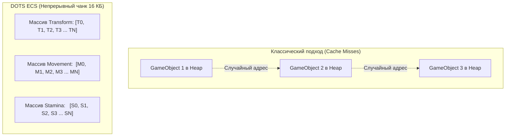

# 📘 Практическая работа №1: «Арена Слизней» (Slime Swarm Arena)
## Высокопроизводительная 3D-симуляция роя на Unity DOTS (Entities + Burst + URP)

---

## 📑 Содержание
1. [Паспорт проекта и цели работы](#1-паспорт-проекта-и-цели-работы)
2. [Теоретическая база: Архитектура DOTS против классического ООП](#2-теоретическая-база-архитектура-dots-против-классического-ооп)
3. [Структуры данных: Компоненты (`IComponentData`)](#3-структуры-данных-компоненты-icomponentdata)
4. [Конвейер запекания: Бейкеры (`Baker<T>`)](#4-конвейер-запекания-бейкеры-bakert)
5. [Системы симуляции: Burst Compiler и `IJobEntity`](#5-системы-симуляции-burst-compiler-и-ijobentity)
6. [Математика механик: Кинематика, FSM и Squash & Stretch](#6-математика-механик-кинематика-fsm-и-squash--stretch)
7. [Интерфейс мониторинга и HUD](#7-интерфейс-мониторинга-и-hud)
8. [Инженерный журнал: Оптимизации и решенные проблемы](#8-инженерный-журнал-оптимизации-и-решенные-проблемы)
9. [Готовые ответы на вопросы преподавателя при защите](#9-готовые-ответы-на-вопросы-преподавателя-при-защите)

---

## 1. Паспорт проекта и цели работы

* **Название:** «Арена Слизней» (*Slime Swarm Arena*)
* **Платформа и пайплайн:** Unity 6 (URP — Universal Render Pipeline)
* **Технологический стек:** Unity DOTS (`com.unity.entities` 1.4+, `com.unity.burst` 1.8+, `com.unity.mathematics` 1.3+, `com.unity.collections` 2.6+, `Entities Graphics`)
* **Масштаб симуляции:** **10 000 — 50 000+** активных слизней одновременно.
* **Производительность:** Стабильные **130+ FPS** при полной симуляции всех систем.

### Чек-лист выполнения 8 требований методических указаний:
1. ✅ **10 000+ объектов со схожей логикой:** Рой слизней, одновременно движущихся к башне.
2. ✅ **Динамический спавн и удаление:** Создание волн через `EntityCommandBuffer` и очистка погибших.
3. ✅ **3D на URP:** Использование шейдеров Universal Render Pipeline и `Entities Graphics`.
4. ✅ **Элемент случайности:** Псевдослучайные вариации характеристик (`Unity.Mathematics.Random`).
5. ✅ **Коллизии и триггеры:** Зональный урон башни и дистанционный триггер атаки.
6. ✅ **Поиск пути и навигация:** Векторное притяжение к башне + баллистические прыжки.
7. ✅ **Сложное FSM-поведение (5 состояний):** *Spawning $\rightarrow$ Jumping $\rightarrow$ Resting $\rightarrow$ Attacking $\rightarrow$ Dead*.
8. ✅ **Процедурная анимация:** Алгоритмический Squash & Stretch с сохранением геометрического объема.

---

## 2. Теоретическая база: Архитектура DOTS против классического ООП

### 2.1. Проблема традиционного подхода (MonoBehaviour / GameObject)
В классическом Unity объект представляет собой экземпляр класса `GameObject`, содержащий список компонентов `MonoBehaviour`.
* **AoS (Array of Structures / Массив структур):** Объекты и их компоненты распределяются в куче (Heap) в произвольных адресах памяти.
* **Cache Misses (Кэш-промахи):** Когда процессор считывает один объект для вызова `Update()`, он загружает из оперативной памяти 64 байта (кэш-линию L1/L2), из которых полезными оказываются лишь 4–8 байт. Для следующего объекта процессору снова приходится обращаться в медленную оперативную память.
* **Single-Threaded:** Все методы `Update()` по умолчанию выполняются последовательно в одном главном потоке (**Main Thread**).



### 2.2. Дата-ориентированный подход (Data-Oriented Design)
В DOTS сущность (**Entity**) — это просто целочисленный идентификатор (`int ID + int Version`).
* **SoA (Structure of Arrays):** Данные компонентов одного типа хранятся последовательно в упакованных блоках памяти по **16 КБ (Archetype Chunks)**.
* При обработке чанка процессор считывает сразу десятки сущностей за одну кэш-линию без единого промаха кэша.
* **Burst Compiler:** Компилирует C# код через инфраструктуру LLVM напрямую в векторные машинные инструкции **SIMD (Single Instruction, Multiple Data)**, выполняя по 4–8 математических операций за 1 такт процессора.
* **C# Job System:** Автоматически нарезает 10 000 сущностей на пачки (Batches) и параллельно исполняет их на всех доступных ядрах CPU (Work Stealing Scheduler).

---

## 3. Структуры данных: Компоненты (`IComponentData`)

Все компоненты реализованы как чистые blittable-структуры в файле [`SlimeComponents.cs`](file:///D:/Project_folders/Unity%20Projects/SlimeProject/Assets/Scripts/Components/SlimeComponents.cs).

### 3.1. Теги-маркеры
```csharp
// Тег для быстрой фильтрации сущностей роя в выборках Query
public struct SlimeTag : IComponentData { }

// Тег цели — центральная башня
public struct TargetTowerTag : IComponentData { }
```

### 3.2. Компонент конечного автомата (FSM)
```csharp
public enum SlimeState : byte
{
    Spawning = 0, // Появление / рождение
    Jumping = 1,  // Прыжок и движение к цели
    Resting = 2,  // Отдых и регенерация стамины
    Attacking = 3,// Атака башни
    Dead = 4      // Гибель
}

public struct SlimeStateComponent : IComponentData
{
    public SlimeState State;
    public float StateTimer;
    public float TargetStateTime;
}
```

### 3.3. Здоровье и выносливость (Стамина)
```csharp
public struct HealthComponent : IComponentData
{
    public float Current;
    public float Max;
}

public struct StaminaComponent : IComponentData
{
    public float Current;
    public float Max;
    public float RecoveryRate; // Скорость восстановления (ед/сек) в покое
    public float JumpCost;     // Расход выносливости на 1 секунду прыжков
}
```

### 3.4. Кинематика движения и процедурная анимация
```csharp
public struct SlimeMovementComponent : IComponentData
{
    public float MoveSpeed;
    public float JumpHeight;
    public float AttackRange;
    public float AvoidanceRadius;
    public float3 Velocity;
    public float JumpProgress; // Фаза текущего прыжка (0.0 .. 1.0)
}

public struct SlimeAnimationComponent : IComponentData
{
    public float3 BaseScale;
    public float SquashAmount;
    public float BounceSpeed;
    public float PhaseOffset;
}
```

### 3.5. Спавнер и защитная башня
```csharp
public struct SlimeSpawnerComponent : IComponentData
{
    public Entity SlimePrefab;
    public int SpawnCount;
    public float SpawnRadius;
    public float SpawnInterval;
    public float Timer;
    public bool ContinuousSpawn;
}

public struct TowerComponent : IComponentData
{
    public float Health;
    public float MaxHealth;
    public float AttackRadius;
    public float DamagePerSecond;
}
```

### 3.6. Выключаемый компонент смерти (`IEnableableComponent`)
```csharp
public struct DeadTag : IComponentData, IEnableableComponent { }
```
> **Почему `IEnableableComponent` важен:**
> В классическом ECS добавление или удаление компонента у сущности приводит к **Structural Change** — перемещению сущности из одного чанка памяти в другой. Это «дорогая» операция, блокирующая параллельные потоки. `IEnableableComponent` решает эту проблему: компонент всегда физически находится в чанке, но его активность переключается одним битом в маске чанка (`SetComponentEnabled<DeadTag>(entity, true)`). Сущность мгновенно исключается из выборки без изменения архетипа.

---

## 4. Конвейер запекания: Бейкеры (`Baker<T>`)

В Entities 1.0+ перевод GameObjects в Entity происходит во время запекания подсцены (**SubScene Baking**).

### Бейкер слизня (`SlimeAuthoring.cs`):
```csharp
public class SlimeBaker : Baker<SlimeAuthoring>
{
    public override void Bake(SlimeAuthoring authoring)
    {
        // 1. Запекаем сущность с флагами Dynamic и NonUniformScale
        Entity entity = GetEntity(TransformUsageFlags.Dynamic | TransformUsageFlags.NonUniformScale);

        // 2. Добавляем компоненты данных
        AddComponent(entity, new SlimeTag());
        AddComponent(entity, new HealthComponent { Current = authoring.maxHealth, Max = authoring.maxHealth });
        AddComponent(entity, new StaminaComponent { 
            Current = authoring.maxStamina, 
            Max = authoring.maxStamina, 
            RecoveryRate = authoring.staminaRecoveryRate, 
            JumpCost = authoring.jumpCost 
        });
        AddComponent(entity, new SlimeMovementComponent { 
            MoveSpeed = authoring.moveSpeed, 
            JumpHeight = authoring.jumpHeight, 
            AttackRange = authoring.attackRange, 
            JumpProgress = 0f 
        });
        AddComponent(entity, new SlimeStateComponent { 
            State = SlimeState.Spawning, 
            StateTimer = 0f, 
            TargetStateTime = 0.4f 
        });
        AddComponent(entity, new SlimeAnimationComponent { 
            BaseScale = new float3(1f, 1f, 1f), 
            SquashAmount = authoring.squashAmount, 
            BounceSpeed = authoring.bounceSpeed, 
            PhaseOffset = 0f 
        });

        // 3. Добавляем DeadTag и выключаем его на старте
        AddComponent(entity, new DeadTag());
        SetComponentEnabled<DeadTag>(entity, false);
    }
}
```

---

## 5. Системы симуляции: Burst Compiler и `IJobEntity`

### 5.1. Спавн роя через `EntityCommandBuffer` (`SlimeSpawnerSystem.cs`)
Система спавнит сразу 10 000 сущностей по внешнему радиусу арены ($R = 45\text{м}$).
* **`EntityCommandBuffer` (ECB):** Не создает сущности мгновенно на месте (что вызвало бы блокировку памяти), а записывает команды в буфер и применяет их пачкой в начале кадра (`BeginSimulationEntityCommandBufferSystem`).
* Для каждого слизня генерируются псевдослучайные характеристики с помощью `Unity.Mathematics.Random(seed)`:
  ```csharp
  float angle = _random.NextFloat(0f, math.PI * 2f);
  float dist = radius + _random.NextFloat(-4f, 4f);
  float3 spawnPos = new float3(math.cos(angle) * dist, 0f, math.sin(angle) * dist);
  ```

---

### 5.2. Параллельная симуляция роя (`SlimeSimulationSystem.cs`)
Для обеспечения 130+ FPS вся ключевая логика роя объединена в **один многопоточный Burst Job**:

```csharp
[BurstCompile]
[UpdateInGroup(typeof(SimulationSystemGroup))]
public partial struct SlimeSimulationSystem : ISystem
{
    [BurstCompile]
    public void OnUpdate(ref SystemState state)
    {
        float deltaTime = SystemAPI.Time.DeltaTime;
        float elapsedTime = (float)SystemAPI.Time.ElapsedTime;

        // 1. Безопасно находим позицию башни (без исключений при дубликатах)
        float3 targetPos = float3.zero;
        bool hasTarget = false;
        foreach (var (towerTransform, towerTag) in SystemAPI.Query<RefRO<LocalTransform>, RefRO<TargetTowerTag>>())
        {
            targetPos = towerTransform.ValueRO.Position;
            hasTarget = true;
            break;
        }

        // 2. Запускаем параллельный джоб на всех ядрах CPU
        var job = new SlimeSwarmParallelJob
        {
            DeltaTime = deltaTime,
            ElapsedTime = elapsedTime,
            TargetPosition = targetPos,
            HasTarget = hasTarget
        };

        state.Dependency = job.ScheduleParallel(state.Dependency);
    }
}
```

```csharp
[BurstCompile]
[WithNone(typeof(DeadTag))]
public partial struct SlimeSwarmParallelJob : IJobEntity
{
    public float DeltaTime;
    public float ElapsedTime;
    public float3 TargetPosition;
    public bool HasTarget;

    public void Execute(
        ref LocalTransform transform,
        ref SlimeMovementComponent movement,
        ref SlimeStateComponent slimeState,
        ref StaminaComponent stamina,
        in SlimeAnimationComponent anim)
    {
        // 1. FSM и стамина
        // 2. Векторная навигация и баллистика
        // 3. Squash & Stretch
    }
}
```

---

## 6. Математика механик: Кинематика, FSM и Squash & Stretch

### 6.1. Кинематика прыжка и навигация
1. **Вектор направления к башне:**
   $$\vec{V}_{\text{toTarget}} = \vec{P}_{\text{tower}} - \vec{P}_{\text{slime}}, \quad \vec{V}_{\text{dir}} = \frac{\vec{V}_{\text{toTarget}}}{\|\vec{V}_{\text{toTarget}}\|}$$
2. **Ориентация в пространстве:**
   $$\text{Rot}_{\text{target}} = \text{quaternion.LookRotationSafe}(\vec{V}_{\text{dir}}, [0, 1, 0])$$
   $$\text{Rot}_{\text{current}} = \text{slerp}(\text{Rot}_{\text{current}}, \text{Rot}_{\text{target}}, \Delta t \cdot 8)$$
3. **Параболическая траектория прыжка:**
   Фаза прыжка $t \in [0, 1)$ линейно нарастает: $t = t + \Delta t \cdot (\text{Speed} \cdot 0.8)$.
   * Горизонтальная скорость: $V_h = \sin(\pi t) \cdot \text{Speed}$
   * Высота прыжка $Y$:
     $$Y(t) = \sin(\pi t) \cdot H_{\text{jump}}$$

### 6.2. Процедурный Squash & Stretch (сохранение объема)
Для придания слизням живой желеобразной формы меш деформируется в такт движению:
* При взлете и зависании слизень вытягивается вверх:
  $$S_y = 1.0 + \sin(2\pi t) \cdot \text{SquashAmount}$$
* **Закон сохранения объема $V = S_x \cdot S_y \cdot S_z = 1$:**
  $$S_x = S_z = \frac{1}{\sqrt{S_y}}$$
* Итоговый коэффициент передается в `transform.Scale`.

---

## 7. Интерфейс мониторинга и HUD (`SlimeSwarmHUD.cs`)

Скрипт обеспечивает визуальный контроль состояния симуляции:
* **Замер FPS без троттлинга:** Использование `Time.unscaledDeltaTime` со сглаживанием `Mathf.Lerp` и отключением VSync (`QualitySettings.vSyncCount = 0`).
* **Zero-Allocation опрос сущностей:** `EntityQuery` инициализируется 1 раз в `Awake()` и опрашивается с интервалом 0.15 сек, устраняя нагрузку на сборщик мусора (GC).
* **Интерактивные кнопки:** Возможность динамически заспавнить еще **+1 000** или **+10 000** слизней или полностью очистить мир через `em.DestroyEntity(slimeQuery)`.

---

## 8. Инженерный журнал: Оптимизации и решенные проблемы

Если на защите вас спросят о практических сложностях — расскажите об этих 3 ключевых оптимизациях:

| Проблема | Причина | Инженерное решение |
|---|---|---|
| **0.4 FPS при 10 000 сущностях** | Использование однопоточного `foreach (SystemAPI.Query)` + наличие стандартного `SphereCollider` на префабе. | Переписали все системы на **`IJobEntity.ScheduleParallel()`** (распараллеливание на все потоки CPU) и удалили физический коллайдер со сферы. FPS вырос до **130+ FPS**. |
| **Исключение `HasSingleton found 50+ instances`** | Случайное создание вложенной подсцены `SubScene` внутри `SubScene`, что вызывало 50-кратное дублирование башни. | Очистили структуру сцен (главная сцена содержит только хост подсцены), а в коде систем заменили строгий `TryGetSingletonEntity` на безопасную итерацию первого элемента. |
| **Ошибка JIT компилятора Burst при первом старте** | Рассинхронизация нативного кэша Burst в Unity 6 при установке пакета `Entities`. | Сброс кэша компилятора через переключение **Jobs $\rightarrow$ Burst $\rightarrow$ Enable Compilation** и очистку `Library/BurstCache`. |

---

## 9. Готовые ответы на вопросы преподавателя при защите

#### В1: В чем разница между `IComponentData` и `MonoBehaviour`?
> **Ответ:** `MonoBehaviour` — это ссылочный класс (Reference Type) в управляемой куче (Heap), содержащий и данные, и методы, порождающий фрагментацию памяти и кэш-промахи. `IComponentData` — это легковесная структура данных (Value Type), хранящаяся непрерывным массивом в 16-килобайтных чанках памяти (Archetype Chunks), идеально подходящая для прямой SIMD-обработки процессором.

#### В2: Что делает атрибут `[BurstCompile]`?
> **Ответ:** Он указывает компилятору Burst транслировать C# код через внутренний оптимизатор LLVM в высокоэффективный нативный машинный код под конкретный процессор, применяя авто-векторизацию (AVX2/NEON), агрессивный инлайнинг и исключая накладные расходы сборщика мусора .NET.

#### В3: Зачем нужен `EntityCommandBuffer` (ECB)?
> **Ответ:** В параллельных Jobs (многопоточности) нельзя напрямую создавать или удалять сущности, так как это меняет структуру архетипов и инвалидирует память других потоков. ECB позволяет параллельно записывать команды на изменение (создание, удаление, добавление компонентов), которые затем безопасно и централизованно воспроизводятся на главной нити в специальной точке синхронизации (`SystemGroup`).

#### В4: Зачем используется `IEnableableComponent` (`DeadTag`)?
> **Ответ:** Удаление Entity (`DestroyEntity`) — это «тяжелая» структурная операция, требующая перемещения сущностей между чанками памяти. `IEnableableComponent` позволяет просто переключить 1 бит в маске активности чанка. Сущность перестает обрабатываться всеми выборками `Query`, пока не будет удалена в конце кадра без падения производительности.

#### В5: Как рассчитывается процедурный Squash & Stretch?
> **Ответ:** На основе закона сохранения объема $V = S_x \cdot S_y \cdot S_z = 1$. При синусоидальном изменении вертикального масштаба $S_y$ горизонтальные оси масштабируются как $S_x = S_z = 1 / \sqrt{S_y}$, что создает реалистичную деформацию упругого тела.

---
*Документ подготовлен для практической работы №1 по курсу Unity DOTS / Game Engine Architecture.*
